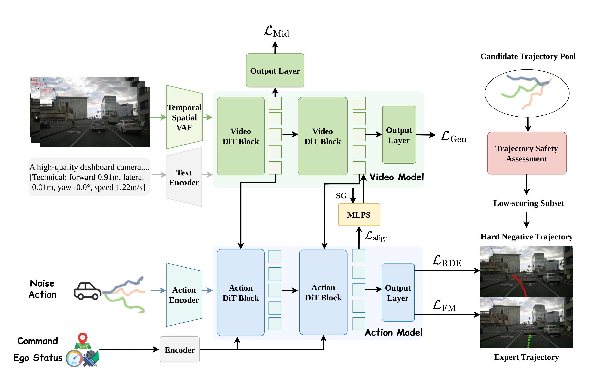
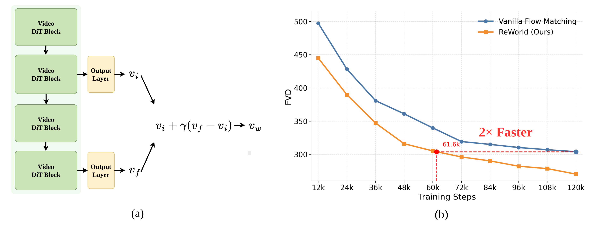
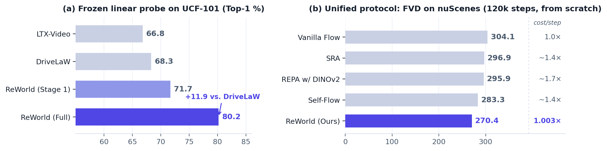
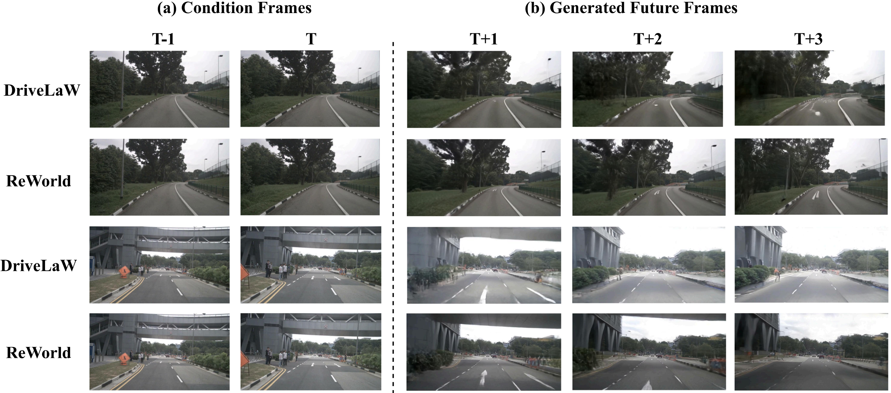
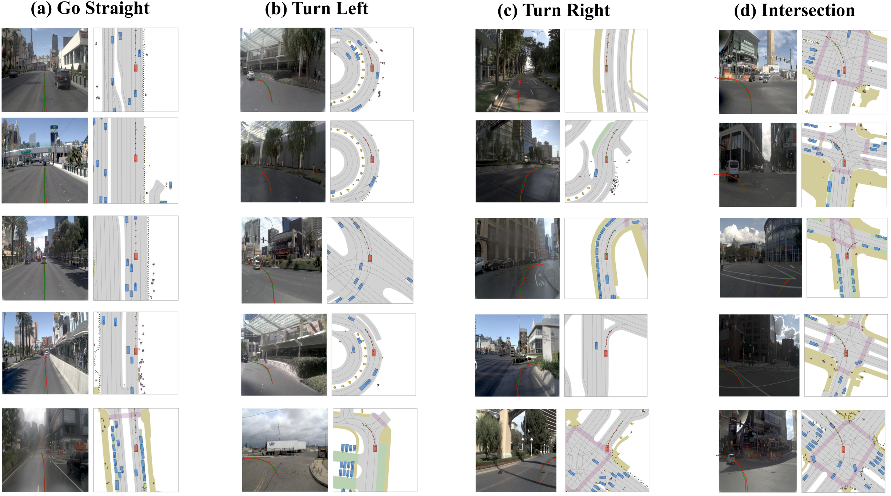

<div align="center">

# ReWorld: Representation Learning for World Action Models

**The first representation learning framework for autonomous-driving World Action Models.**

[](https://arxiv.org/abs/2606.27504)
[](https://xiaomi-research.github.io/reworld/)
[](https://huggingface.co/tz2026/ReWorld)
[](LICENSE)
[](pyproject.toml)

[Tianze Xia](mailto:xiatianze@hust.edu.cn)<sup>1,2*</sup>, Lijun Zhou<sup>2*</sup>, Kaixin Xiong<sup>2</sup>, Jingfeng Yao<sup>1</sup>, Zhenxin Zhu<sup>2</sup>, Haiyang Sun<sup>2</sup>, Bing Wang<sup>2</sup>, Guang Chen<sup>2</sup>, Wenyu Liu<sup>1</sup>, Hangjun Ye<sup>2</sup>, Xinggang Wang<sup>1†</sup>

<sup>1</sup> Huazhong University of Science and Technology &nbsp;&nbsp; <sup>2</sup> Xiaomi EV
<br>
<sup>*</sup> Equal contribution &nbsp;&nbsp; <sup>†</sup> Corresponding author



</div>

---

## :sparkles: Highlights

- **Better futures** — FVD **81.3 → 61.9** (−23.9%) on nuScenes video generation, with self-guided sampling enabled for free by intermediate supervision.
- **Safer plans** — closed-loop PDMS **89.1 → 90.4** on NAVSIM *Navtest*, with best-in-class NC / DAC / TTC among world-model planners — no RL, no test-time scoring.
- **Stronger representations** — frozen linear probe on UCF-101 action recognition **68.3% → 80.2%** (+11.9 pts over the DriveLaW baseline).
- **Nearly free** — no external encoders, no teacher models, only **+0.3%** per-step Video DiT training cost, and roughly **2× faster** convergence from scratch.

## :bulb: Why ReWorld?

World Action Models (WAMs) couple future environment prediction with action generation, yet standard training supervises only the output ends of the generation and planning modules. The intermediate representations that carry world knowledge are shaped only indirectly, as byproducts of fitting these outputs. We call this the **representation bottleneck of WAMs**: the world-to-action pathway is not explicitly optimized to be future-predictive, cross-modally grounded, or sensitive to closed-loop behavior quality.

ReWorld removes this bottleneck by treating intermediate representations as **direct targets of optimization**, through three complementary stages:

- **Stage 1 · Future-predictive world representation** — impose future-flow supervision on intermediate Video DiT states. The resulting cross-layer prediction hierarchy enables **self-guided sampling** at inference and yields roughly **2× faster** convergence from scratch.
- **Stage 2 · World-grounded action representation** — with the Video DiT frozen, align post-cross-attention Action DiT states with their attended video readouts, so that retrieved world information is **retained** in the representations used for planning.
- **Stage 3 · Behavior-aware action shaping** — jointly fine-tune both branches with hard-negative repulsion: predictions are pushed away from geometrically close yet low-scoring trajectories, separating the expert from nearby unsafe alternatives.

All supervision is constructed entirely from the WAM's own generation targets, attended features, and trajectory candidates — requiring **no external encoders or teacher models** and adding only **0.3%** per-step Video DiT training cost.

> **Why sequential?** The three stages play distinct optimization roles: Stage 1 first establishes future-predictive structure in the video representation; Stage 2 then grounds the action representation in a stable video feature space; Stage 3 finally allows planning-oriented gradients to jointly adapt the Action DiT and the planner-facing Video DiT states. Stage 2 requires stop-gradient readouts derived from frozen video features to establish a stable grounding target, whereas Stage 3 intentionally allows decision-oriented gradients to reshape the planner-facing video states.

<div align="center">

</div>

## :trophy: Results at a Glance

<details open><summary><b>Video generation on nuScenes</b> (val)</summary>

<div align="center">

| Method | FID ↓ | FVD ↓ |
|:---|:---:|:---:|
| DriveDreamer | 52.6 | 452.0 |
| Vista | 6.9 | 89.4 |
| Epona | 7.5 | 82.8 |
| DriveLaW | 4.6 | 81.3 |
| **ReWorld (Ours)** | **4.4** | **61.9** |

</div>

</details>

<details open><summary><b>Closed-loop planning on NAVSIM <i>Navtest</i></b></summary>

<div align="center">

| Method | NC ↑ | DAC ↑ | TTC ↑ | Comf. ↑ | EP ↑ | PDMS ↑ |
|:---|:---:|:---:|:---:|:---:|:---:|:---:|
| DiffusionDrive (cam+lidar) | 98.2 | 96.2 | 94.7 | 100 | 82.2 | 88.1 |
| Epona | 97.9 | 95.1 | 93.8 | 99.9 | 80.4 | 86.2 |
| PWM | 98.6 | 95.9 | 95.4 | 100 | 81.8 | 88.1 |
| WorldDrive | 98.4 | 96.8 | 95.2 | 100 | **83.3** | 89.0 |
| DriveLaW | 99.0 | 97.1 | 96.7 | 100 | 81.3 | 89.1 |
| **ReWorld (Ours)** | **99.1** | **98.2** | **97.7** | 99.8 | 82.0 | **90.4** |

</div>

</details>

**Do the representations themselves actually improve?** — the experiment we care most about:

<div align="center">

</div>

Driving-domain pretraining alone barely moves the probe (+1.5 over LTX-Video); the representation curriculum adds **+11.9**. And under a unified from-scratch protocol (120k steps, nuPlan + nuScenes, no text encoder), ReWorld beats the strongest self-supervised baseline by **12.9 FVD** at **1.003×** per-step cost — teacher-based and extra-forward methods pay ~1.4–1.7× for less.

<details><summary><b>Full numbers</b> (UCF-101 probe & unified protocol)</summary>

| Frozen Video DiT | Top-1 Acc. (%) ↑ |
|:---|:---:|
| LTX-Video | 66.8 |
| DriveLaW | 68.3 |
| ReWorld (Stage 1) | 71.7 |
| **ReWorld (full)** | **80.2** |

| Method (120k steps, from scratch) | FVD ↓ | Training cost |
|:---|:---:|:---:|
| Vanilla Flow | 304.1 | 1.0× |
| SRA / Self-Flow | 296.9 / 283.3 | ~1.4× |
| REPA w/ DINOv2 | 295.9 | ~1.7× |
| **ReWorld (Ours)** | **270.4** | **1.003×** |

</details>

<div align="center">

<br><i>1s history → 3s future. ReWorld yields sharper lane markings, more stable roadside structure, and clearer distant agents.</i>
<br><br>

<br><i>NAVSIM Navtest rollouts (red: ReWorld prediction, green: expert) — straight, left turn, right turn, intersection.</i>
</div>

## :rocket: Getting Started

### Installation

Python ≥ 3.10, CUDA GPU recommended.

```bash
# Stage 1 (Video DiT) — from repo root
pip install -U pip setuptools && pip install -e .

# Stages 2–3 (Action planner + NAVSIM)
cd DriveLaW-Act && pip install -e .
```

Then follow [`DriveLaW-Act/docs/install.md`](DriveLaW-Act/docs/install.md) to download OpenScene / nuPlan maps and set environment variables (`NAVSIM_DEVKIT_ROOT`, `NAVSIM_EXP_ROOT`, `OPENSCENE_DATA_ROOT`, `NUPLAN_MAPS_ROOT`). Place [LTX-Video 0.9.5](https://huggingface.co/Lightricks/LTX-Video) weights locally or point the YAMLs at the HF id.

### Data preparation

- **Stage 1 (video clips):** point `video_root` in [`configs/dualflow/dit_train.online.example.yaml`](configs/dualflow/dit_train.online.example.yaml) at your driving clips. Paper geometry: 33 frames (9 condition + 24 future), 1024×512, LTX temporal 8 / spatial 32 compression. For IG inference, name conditioning clips `scene_XXXX_window_000_conditioning.mp4`.
- **Stages 2–3 (NAVSIM caches):** cache features and metrics —
  ```bash
  cd DriveLaW-Act
  sh scripts/evaluation/run_caching_videodrive_hidden_state.sh
  sh scripts/evaluation/run_metric_caching.sh
  ```
  Optional warm-start: pretrained weights on 🤗 [tz2026/ReWorld](https://huggingface.co/tz2026/ReWorld) (base DriveLaW weights: [tz2026/DriveLaW](https://huggingface.co/tz2026/DriveLaW)).
- **Stage 3 hard negatives:** an offline pool of `{scene_token}.pkl` (`pdm_score_matrix` (N,7) + `pred_trajectorys` (N,L,3)) under `negative_samples_path` — [download](https://drive.google.com/file/d/1M3U5VvhL58QmG91PMr6EH5M6EfPwmRF_/view?usp=drive_link) or generate with [BeyondDrive](https://github.com/wjl2244/BeyondDrive). Format: [`beyonddrive_negatives.py`](DriveLaW-Act/navsim/agents/videodrive/beyonddrive_negatives.py).

### Training & inference

**Stage 1 — future-predictive Video DiT** (edit [`configs/dualflow/dit_train.online.example.yaml`](configs/dualflow/dit_train.online.example.yaml): `video_root`, `vae_model_source`, `output_dir`):

```bash
# from repo root
bash train_reworld_stage1.sh
```

**Self-guided video generation** (edit [`configs/dualflow/sample_reworld.yaml`](configs/dualflow/sample_reworld.yaml): `conditioning_dir`, `dit_checkpoint`, `vae_model_source`, `output_root`):

```bash
# from repo root
bash infer_reworld_stage1.sh
```

**Stage 2 — cross-modal alignment** (Video DiT frozen):

```bash
cd DriveLaW-Act
sh scripts/training/run_videodrive_train_stage2_align.sh
```

**Stage 3 — RDE with hard negatives** (joint fine-tune):

```bash
cd DriveLaW-Act
sh scripts/training/run_videodrive_train_stage3_rde.sh
```

**Evaluate** (NAVSIM PDMS):

```bash
cd DriveLaW-Act
sh scripts/evaluation/run_videodrive_agent_pdm_score_evaluation.sh
```

> Optional base imitation before Stage 2: `scripts/training/run_videodrive_train.sh` with [`video_model_train_base.yaml`](DriveLaW-Act/navsim/agents/videodrive/configs/ltx_model/video_model_train_base.yaml), or start from the 🤗 DriveLaW checkpoint.

## :pray: Acknowledgments

ReWorld builds on [DriveLaW](https://arxiv.org/abs/2512.23421), [NAVSIM](https://github.com/autonomousvision/navsim), [LTX-Video](https://github.com/Lightricks/LTX-Video), [Diffusers](https://github.com/huggingface/diffusers),  [BeyondDrive](https://github.com/wjl2244/BeyondDrive), [Internal Guidance](https://arxiv.org/abs/2512.24176). Thanks to all of them for open-sourcing.

## :pencil: Citation

```bibtex
@article{xia2026reworld,
  title   = {ReWorld: Learning Better Representations for World Action Models},
  author  = {Xia, Tianze and Zhou, Lijun and Xiong, Kaixin and Yao, Jingfeng and Zhu, Yu and Zhu, Zhenxin and Wang, Bing and Chen, Guang and Ye, Hangjun and Liu, Wenyu and others},
  journal = {arXiv preprint arXiv:2606.27504},
  year    = {2026}
}
```

## :mailbox: Contact

Tianze Xia — xiatianze@hust.edu.cn · Xinggang Wang — xgwang@hust.edu.cn
